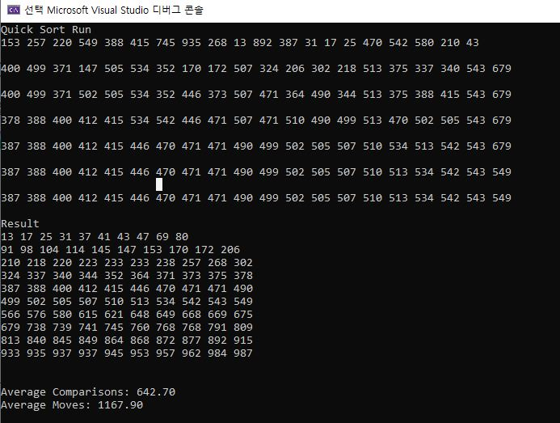

# 14-quicksort{Result Image}

Quick Sort (퀵 정렬)
분할 정복 알고리즘으로 데이터를 피벗 기준으로 나누고, 재귀 대신 스택을 활용하여 정렬.
평균적으로 가장 빠르고 메모리 사용이 적어 널리 사용됨.
시간 복잡도: 평균 O(n log n), 최악 O(n²) 
최악의 경우를 방지하려면 랜덤 피벗 선택 등의 개선 기법 필요.

Selection Sort (선택 정렬)
매 단계에서 최소값(또는 최대값)을 찾아 현재 위치에 교환.
단순하지만 비교 횟수가 많아 비효율적.
시간 복잡도: O(n²)

Insertion Sort (삽입 정렬)
배열의 요소를 순차적으로 탐색하며, 적절한 위치에 삽입.
이미 정렬된 배열에서는 빠름.
시간 복잡도: O(n²), 최선 O(n).

Bubble Sort (버블 정렬)
인접한 두 요소를 비교하여 교환하며, 큰 값을 점차 뒤로 이동.
효율이 가장 낮음.
시간 복잡도: O(n²).

Shell Sort (셸 정렬)
삽입 정렬의 개선 버전으로, 간격을 조정하며 정렬 수행.
시간 복잡도: 평균 O(n log² n).

Merge Sort (합병 정렬)
데이터를 반으로 나누고, 재귀적으로 정렬 후 병합.
안정적인 정렬 방식으로 대규모 데이터에 적합.
시간 복잡도: O(n log n).
