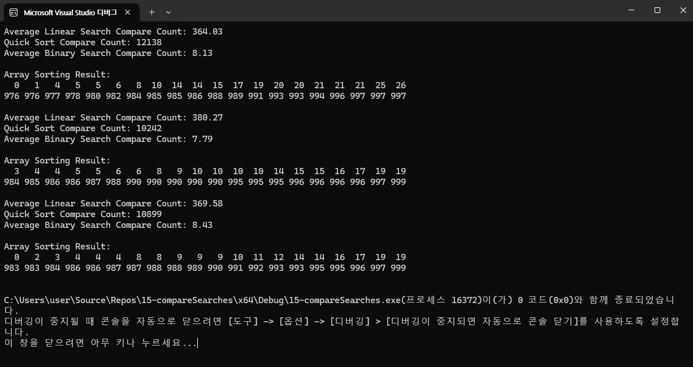

# 15-compareSearches{Result Image}

퀵 정렬 후 이진 탐색이 순차 탐색보다 비교 횟수가 적은 이유:
순차 탐색은 배열의 모든 요소를 차례로 확인하므로, 평균적으로 N/2번의 비교가 필요합니다.
이진 탐색은 매번 탐색 범위를 절반으로 줄이기 때문에, 비교 횟수가 log2(N)에 비례합니다. 배열 크기가 커질수록 순차 탐색과 이진 탐색의 비교 횟수 차이는 더욱 커집니다.

이진 탐색은 배열이 정렬된 상태여야 동작합니다. 퀵 정렬은 배열을 정렬해 이진 탐색이 가능하도록 준비 작업을 수행합니다.
정렬 과정에서의 비교 횟수는 이진 탐색과 독립적이며, 탐색 속도를 개선하기 위해 한 번만 수행됩니다.

정렬된 배열에서는 이진 탐색이 빠르게 대상 요소를 찾을 수 있습니다. 순차 탐색은 배열 크기에 비례하여 탐색 시간이 증가하지만, 이진 탐색은 배열 크기가 증가해도 비교 횟수가 완만하게 증가합니다.
