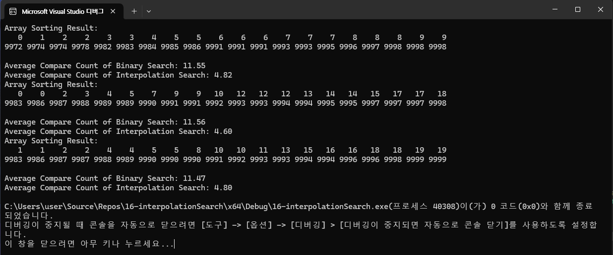

# 16-interpolationSearch{Result Image}

Interpolation Search가 Binary Search보다 적게 비교하는 이유:
Binary Search는 값의 분포와 무관하게 일정한 방식으로 탐색 범위를 줄이므로 비교 횟수가 상대적으로 많습니다. Interpolation Search는 값의 분포를 활용하여 탐색 위치를 예측하고, 균등 분포일수록 효율적으로 작동하여 비교 횟수를 줄일 수 있습니다.
