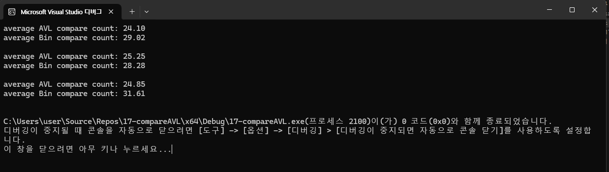

# 17-compareAVL{Result Image}

이진 탐색 트리(BST)와 AVL 트리는 모두 효율적인 탐색, 삽입, 삭제를 목적으로 설계된 이진 트리 구조입니다. 그러나 AVL 트리는 BST의 단점인 불균형 문제를 해결하기 위해 설계된 균형 이진 탐색 트리입니다.

이진 탐색 트리:
평균 비교 횟수가 AVL 트리에 비해 높음.
이는 트리가 불균형해질 가능성이 있기 때문으로, 삽입 순서에 따라 일부 경로가 긴 노드 연결을 가지게 됨.
랜덤 데이터를 사용할 경우에도 완전한 균형을 유지하지 못함.

AVL 트리:
평균 비교 횟수가 항상 이진 탐색 트리보다 낮음.
AVL 트리는 삽입 및 삭제 시 균형을 유지하도록 회전 연산을 수행하므로, 트리의 높이가 항상 O(logn)에 가까워 탐색 효율성이 높음.

AVL 트리는 이진 탐색 트리보다 더 효율적인 탐색 성능을 보임.
이는 AVL 트리가 항상 균형 상태를 유지하도록 설계되었기 때문이며, 특히 대규모 데이터에서 효율성이 더 두드러짐.
AVL 트리는 항상 트리의 균형을 유지하여 탐색 효율성을 극대화합니다. 반면, 이진 탐색 트리는 불균형 가능성 때문에 탐색 성능이 떨어질 수 있습니다. 따라서 AVL 트리는 삽입, 삭제, 탐색이 빈번한 애플리케이션에서 더 적합하며, 이진 탐색 트리는 단순하고 삽입/삭제가 드물며 메모리 사용량을 최소화하려는 경우에 적합합니다.
